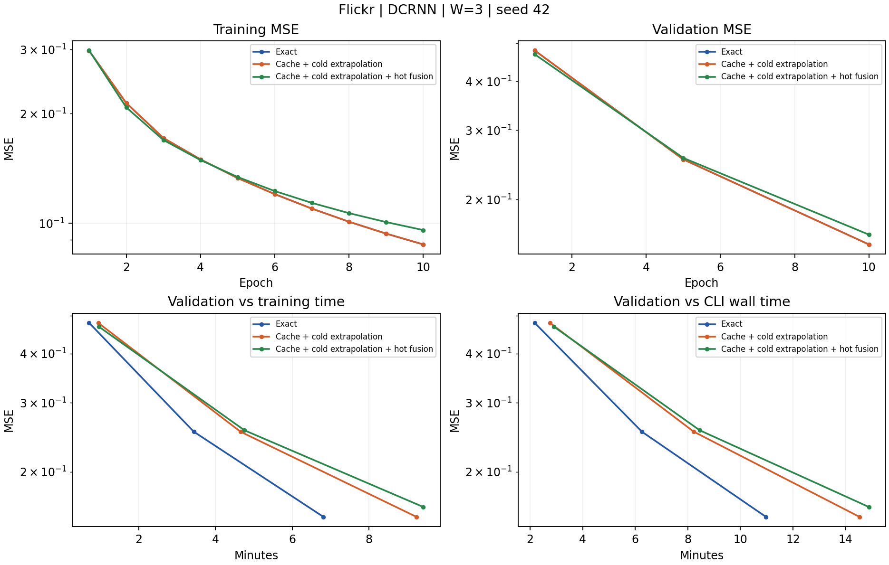

# Flickr W=3 DCRNN

**状态：三组已完成。**

三组采用相同窗口、节点监督、seed 和优化器。测试列为各组实际返回状态的 MSE。

| 组别 | 轮数 | 最优验证 MSE | 选中轮 | 实际测试 MSE | 训练秒/轮中位数（第2轮起） |
|---|---:|---:|---:|---:|---:|
| Exact | 10 | 0.15364307 | 10 | 0.11763852 | 40.51 |
| Cache + cold extrapolation | 10 | 0.15364831 | 10 | 0.11764517 | 55.20 |
| Cache + cold extrapolation + hot fusion | 10 | 0.16275131 | 10 | 0.12715962 | 56.39 |

时间含读取审计。10 轮短跑中，exact/cache 在 GPU 0/1 顺序执行，smooth 在 GPU 2/3 并行执行；共享主机资源可能影响计时。单 seed 尚不能说明统计显著性。

## 最后训练轮的逐槽位读取

| 组别 | 状态 | 槽位（旧→新） | 平均滞后 | 有非零外推量的行数 |
|---|---|---:|---:|---:|
| cache | cold_history_inputs | 0 | 0.0000 | 0 |
| cache | cold_history_inputs | 1 | 0.0000 | 0 |
| cache | cold_history_inputs | 2 | 0.0000 | 0 |
| cache | hot_shared_predictions | 0 | 0.4993 | 5978798 |
| cache | hot_shared_predictions | 1 | 0.4812 | 5983502 |
| cache | hot_shared_predictions | 2 | 1.4640 | 12435768 |
| smooth | cold_history_inputs | 0 | 0.0000 | 0 |
| smooth | cold_history_inputs | 1 | 0.0000 | 0 |
| smooth | cold_history_inputs | 2 | 0.0000 | 0 |
| smooth | hot_shared_predictions | 0 | 0.4998 | 5984778 |
| smooth | hot_shared_predictions | 1 | 0.4815 | 5987570 |
| smooth | hot_shared_predictions | 2 | 1.4643 | 12435768 |

热点预测目标为当前快照输出；冷节点输入目标为前一快照输出，两者滞后不能混算。

配置、过滤、公式和计时范围见 [protocol.md](protocol.md)。原始指标见 [raw](raw)，达到固定验证阈值的时间见 [time_to_target.csv](time_to_target.csv)（仅按验证观测点统计）。
