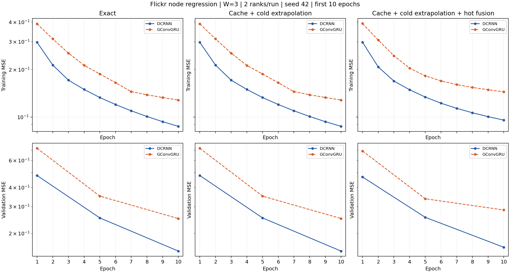

# DCRNN 与 GConvGRU：前 10 轮 MSE 对照

**状态：六组前 10 轮训练与验证已齐备。**

Flickr 节点回归、W=3 滑动快照、每组双卡、seed=42、hidden=8、Adam lr=0.001、access_pipeline 开启。三种策略分别比较两种模型。训练曲线逐轮记录，验证仅在第 1、5、10 轮测量；连线不表示中间轮有验证观测。

GConvGRU 使用已完成同配置长跑的前 10 轮；优化器无按总轮数变化的学习率计划。DCRNN 按新要求短跑 10 轮。没有混入 GConvGRU 的 100 轮最终测试指标。源码 hashes 和公共配置已校验一致。

| 模型 | 策略 | 已记录轮数 | 第10轮训练 MSE | 第10轮验证 MSE |
|---|---|---:|---:|---:|
| DCRNN | exact | 10 | 0.08747313 | 0.15364307 |
| DCRNN | cache | 10 | 0.08747411 | 0.15364831 |
| DCRNN | smooth | 10 | 0.09578589 | 0.16275131 |
| GConvGRU | exact | 10 | 0.12830335 | 0.25059717 |
| GConvGRU | cache | 10 | 0.12833992 | 0.25073050 |
| GConvGRU | smooth | 10 | 0.14466505 | 0.28501802 |

这是单 seed 的早期学习曲线，不代表最终收敛精度。DCRNN 各组并行使用不同 GPU 对，本图不据此给出跨模型严格耗时结论。

数据：[mse_curves.csv](mse_curves.csv)，矢量图：[mse_comparison.pdf](mse_comparison.pdf)。
