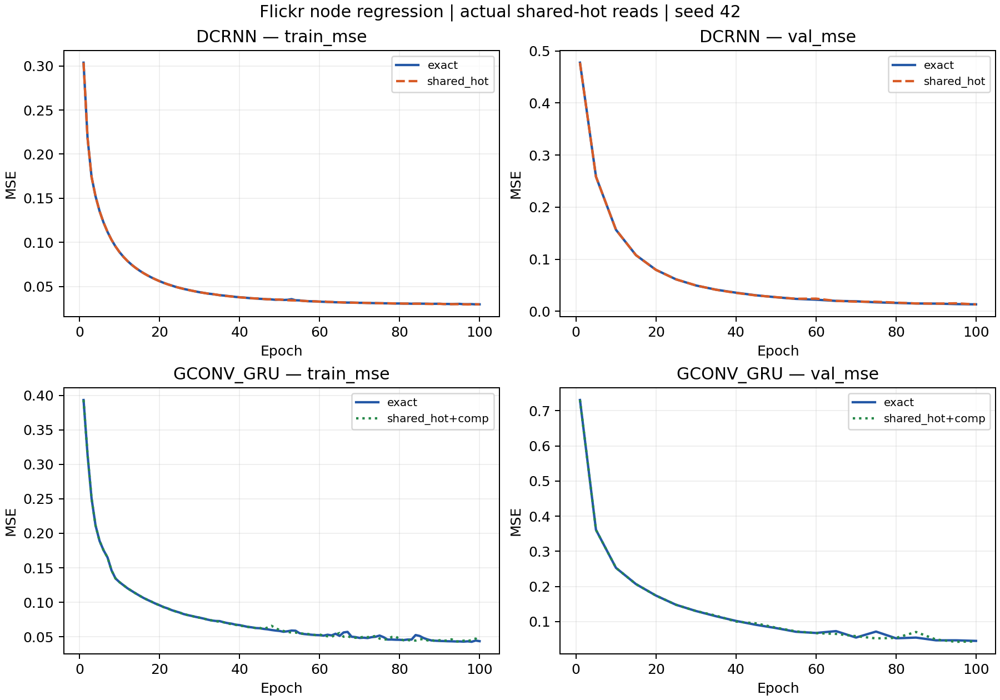
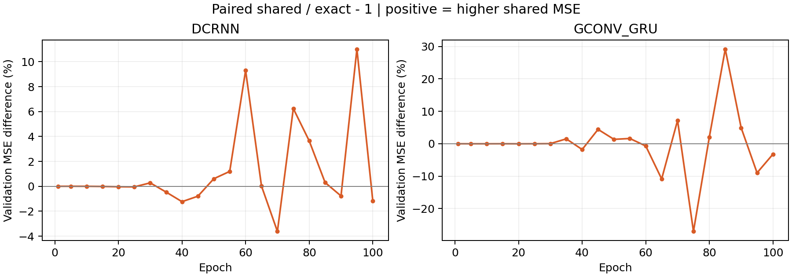
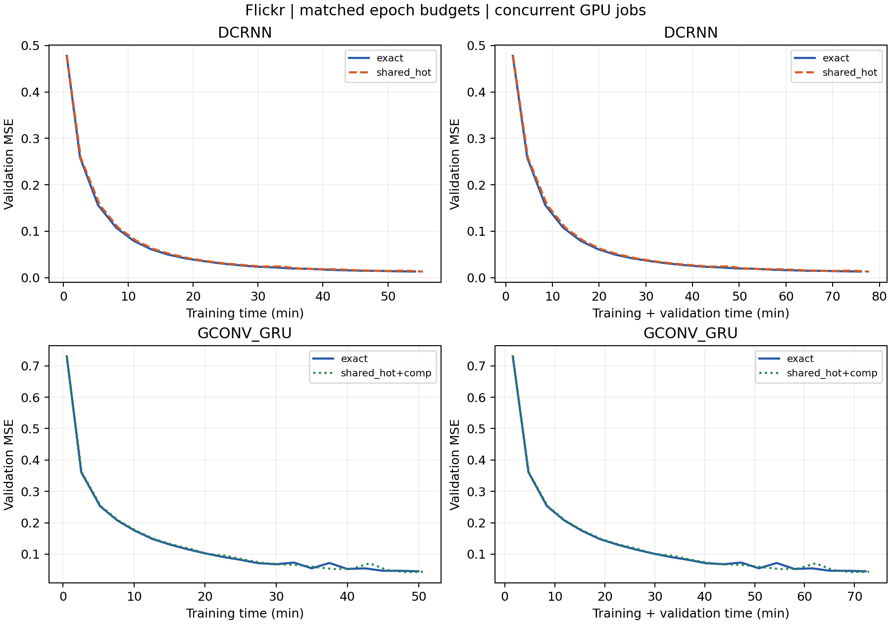

# Flickr 实际 shared_hot 读取消融

**状态：4 组主对照已完成；2 组补偿开关有效性检查已结束。**

本地当前 starrygl-open；Flickr，节点下一快照 log-in-degree 回归；2 个 rank，10% hot 节点，hidden=8，Adam lr=0.001，seed=42，最多 100 轮，每 5 轮验证。训练/验证/测试按快照时间划分为 28/14/28 个窗口；各 split 最后一个无标签窗口推进状态但不计入损失。

`bounded_stale` 直接使用当前 `AsyncMemoryCommitter/materialize_bounded` 返回的状态，未注入固定延迟。max_staleness=1 使用默认余弦刷新阈值 0.3；本实验 access_pipeline=False、wait_policy=block。checkpoint 按实际策略验证 MSE 选择，测试分别重放实际策略和 exact 状态。

| 模型 | 组别 | 已完成轮数 | 最优验证 MSE | 选择轮数 | 实际读取 test MSE | exact 重放 test MSE |
|---|---|---:|---:|---:|---:|---:|
| dcrnn | exact | 100 | 0.01328379 | 100 | 0.02334202 | 0.02334202 |
| dcrnn | shared_hot | 100 | 0.01312844 | 100 | 0.02301401 | 0.02301964 |
| gconv_gru | exact | 100 | 0.04518540 | 100 | 0.04857231 | 0.04857231 |
| gconv_gru | shared_hot+comp | 100 | 0.04261689 | 95 | 0.04616281 | 0.04617456 |

同轮验证误差差异（正值表示 shared_hot 的误差较大；只比较两组共同验证的轮次）：

时间对比（每个模型按两组共同完成的轮数统计）：

| 模型 | 组别 | 配对轮数 | 平均每轮训练 / 秒 | 累计训练 / 分钟 | 训练＋验证 / 分钟 |
|---|---|---:|---:|---:|---:|
| dcrnn | exact | 100 | 32.52 | 54.19 | 76.06 |
| dcrnn | shared_hot | 100 | 33.25 | 55.42 | 77.79 |
| gconv_gru | exact | 100 | 29.98 | 49.96 | 72.20 |
| gconv_gru | shared_hot+comp | 100 | 30.37 | 50.62 | 72.90 |

达到相同验证误差的时间（首次观测到达的验证轮次）：

| 模型 | 组别 | 验证 MSE 阈值 | 首次轮数 | 训练 / 分钟 | 训练＋验证 / 分钟 |
|---|---|---:|---:|---:|---:|
| dcrnn | exact | 0.05 | 30 | 16.19 | 23.48 |
| dcrnn | exact | 0.02 | 65 | 35.16 | 49.73 |
| dcrnn | shared_hot | 0.05 | 30 | 16.79 | 24.32 |
| dcrnn | shared_hot | 0.02 | 65 | 36.24 | 51.26 |
| gconv_gru | exact | 0.1 | 45 | 22.53 | 33.15 |
| gconv_gru | exact | 0.05 | 90 | 45.01 | 65.13 |
| gconv_gru | shared_hot+comp | 0.1 | 45 | 22.89 | 33.54 |
| gconv_gru | shared_hot+comp | 0.05 | 90 | 45.63 | 65.74 |

计时为 rank 0 的同步 CUDA 实测值；训练包括逐批读取审计，但不包括每轮开始前的状态重置及结束后的审计汇总。验证包括状态重置、前序训练窗口预热和验证计算。“训练＋验证”是两段计时之和，未计入 Prepare、启动加载、训练轮间状态重置、检查点写盘和最终测试，不能当作端到端墙钟时间。验证每 5 轮执行，首次到达只在观测点判定；阈值用于事后时间比较。

四组任务共享四张 A40，每个模型使用两个 rank；exact 在 GPU 0/1，shared_hot 在 GPU 2/3，同一策略下两个模型并行。access_pipeline=False 且存在审计开销，因此只能描述本次实验耗时，不能归因为策略的独占吞吐差异。最终测试中 shared_hot 组额外重放 exact，测试总耗时不能直接与 exact 组相除。详细时间见 [timing.csv](timing.csv) 和 [time_to_target.csv](time_to_target.csv)。

GConvGRU shared 组保留补偿开关；即使增量为零，查表、掩码和额外梯度处理仍执行，因此该组时间差也包含补偿路径开销。初期两组短补偿检查也曾并行运行。当前代码路径仍需 cold-node owner 拉取，并额外执行 hot 候选过滤和发布；GCN 计算量不随缓存命中减少。上述路径事实说明 shared_hot 不保证加速，但各部分对本次耗时的贡献尚未 profiling，不能由总时间差直接归因。

实际读取审计（四组主实验最后一个已完成训练轮次）：

| 模型 / 组别 | 训练 shared 读取比例 | shared 平均滞后 | owner 滞后行 | 未来状态行 |
|---|---:|---:|---:|---:|
| dcrnn / exact | 0.0000% | 0.0000 | 0 | 0 |
| dcrnn / shared_hot | 3.9586% | 0.4719 | 0 | 0 |
| gconv_gru / exact | 0.0000% | 0.0000 | 0 | 0 |
| gconv_gru / shared_hot+comp | 3.0651% | 0.4690 | 0 | 0 |

shared 比例按实际请求的节点状态行计算，不是消息边的权重比例。状态由快照 s 产生时记录版本 s+1；快照 t 期望版本 t，实际滞后为 t−返回版本。max_staleness 控制跳过发布刷新次数，结果中的滞后来自真实时间戳审计。

当前补偿在本次 owner-only 的 full-snapshot 分区中没有非零更新：shared 行属于远端节点，当前增量估计器只更新本地计算的节点。小图 with/without compensation 训练、验证及测试数值相同；完整运行记录计数和 gamma，不能把零更新解释为补偿带来的提升。

两组重复的补偿开关长跑在前 4 轮训练 MSE 逐轮完全相同、增量更新为零后停止；保留 DCRNN exact/shared_hot 和 GConvGRU exact/shared_hot+comp 主对照。GConvGRU 的 comp 标志保留当前默认开关，但本布局下补偿没有非零更新。

单个 seed 的成对试验用于初步评估，不能说明多次运行的统计显著性。训练计时包含审计，多个任务共享设备，不用于吞吐性能结论。

任务参照：直接沿用当前快照的 log-in-degree，验证 MSE=0.00562756，测试 MSE=0.01507541。这有助于判断绝对预测精度，不能仅因 exact/stale 接近就认定模型已经充分收敛。

完整主对照的测试误差变化（不同训练轨迹、分别按验证选择检查点）：

- dcrnn: shared 主对照相对 exact 主对照的 test MSE 为 -1.405%；检查点分别为第 100 / 100 轮。此差异包含训练轨迹与检查点选择差异，不能当作单次 stale 读取的收益。
- gconv_gru: shared 主对照相对 exact 主对照的 test MSE 为 -4.961%；检查点分别为第 95 / 100 轮。此差异包含训练轨迹与检查点选择差异，不能当作单次 stale 读取的收益。

实际策略测试重放的状态读取审计：

| 模型 / shared 组 | shared 读取比例 | shared 平均滞后 | owner 滞后行 | 未来状态行 |
|---|---:|---:|---:|---:|
| dcrnn | 5.4746% | 0.5043 | 0 | 0 |
| gconv_gru | 4.4205% | 0.5056 | 0 | 0 |

进程启动到最后一轮训练及验证记录写完的墙钟时间：

| 模型 | 组别 | 墙钟 / 分钟 |
|---|---|---:|
| dcrnn | exact | 76.23 |
| dcrnn | shared_hot | 77.95 |
| gconv_gru | exact | 72.28 |
| gconv_gru | shared_hot+comp | 72.98 |

墙钟按 Linux 进程启动时间与最后一轮 epochs.jsonl 修改时间重建，精度约秒级；包含启动加载、训练、验证、轮间状态重置和训练阶段检查点写入，不含数据转换、Prepare 和最终测试。原始起点见 process_starts.json，终点随 raw/ 的 copy2 保留。

同一检查点切换读取方式的影响：

- dcrnn / shared_hot: ΔMSE=-5.6249124e-06 (-0.02444%)，实际读取 RMSE=0.15170370。
- gconv_gru / shared_hot+comp: ΔMSE=-1.174653e-05 (-0.02544%)，实际读取 RMSE=0.21485532。

固定预算末段趋势（80 → 100 轮的验证 MSE；下降仍不等于达到平台）：

- dcrnn / exact: 0.01603922 → 0.01328379 (-17.18%)。
- dcrnn / shared_hot: 0.01662458 → 0.01312844 (-21.03%)。
- gconv_gru / exact: 0.05262099 → 0.04518540 (-14.13%)。
- gconv_gru / shared_hot+comp: 0.05371621 → 0.04373170 (-18.59%)。

四组最后 20 轮的验证误差仍下降约 14%–21%，因此这里只报告固定 100 轮预算的精度，不能宣称已经充分收敛。所有模型的测试 MSE 也高于上述 persistence 基线。

最终核验见 [verification.json](verification.json)：每组 100 个训练记录、21 次验证、27 个测试计分窗口；两个 rank 的模型检查点逐张量一致；所有已记录训练、验证和测试读取均无 owner 滞后或未来状态。实现测试记录为 272 passed / 15 skipped，另通过 DCRNN 单/双 rank 完整训练与梯度对齐检查。

原始配置、源码 SHA256、逐轮指标和结果见 [raw](raw)，汇总数据见 [summary.json](summary.json) 与 [curves.csv](curves.csv)。复现实验见 [reproduce.md](reproduce.md)，实际算法见 [algorithm.md](algorithm.md)。运行 `python analyze.py` 可用本目录归档重新生成报告和图表。所有数字来自当前运行；不混入历史 TGM 结果。
