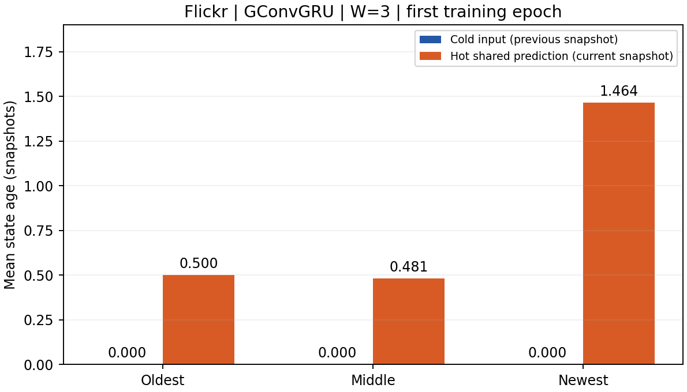

# 新公式短程观察（首轮，尚非收敛结论）

Flickr、GConvGRU、两卡 GPU 0/1、W=3、跨 batch 图/特征流水开启。

- 训练 27 个有标签步骤，28 次边界提交；训练耗时 45.47 秒，验证含训练段预热 100.18 秒。
- 训练 MSE=0.39179212，验证 MSE=0.69243592；不能用一轮结果判断最终收敛。
- sigmoid(γ)：0.62245935 → 0.62430066；rank0 梯度绝对值累计 0.07870218，收到 28 次梯度。
- 热点候选发布比例（rank0）：50.0004%。
- 冷节点三个槽位都已具备所需前一快照输入，外推量为零；热点共享预测存在非零外推。较旧槽位约一半读取仍滞后一帧，最新槽位滞后一至两帧。
- 未来状态读取和 owner 滞后计数均为零。

图中统计跨 batch、跨两个 rank 的读取行数，按窗口内相对位置归类；不是去重节点数。冷输入和热预测的目标版本不同。过滤让较旧槽位也会缺少更新，因此不能只补最后一个槽位。通信重叠没有用 GPU 时间线量化。正式三组 100 轮曲线由队列自动生成到 [report.md](report.md)。

短程完整测试已完成：实际 test MSE=0.53809046；总 CLI 耗时 329.85 秒。这是仅训练一轮的结果。正式 100 轮 exact 已启动，随后运行 cache 与 smooth。

## 同配置 exact 首轮对照

| 方法 | 训练秒/轮 | 验证 MSE |
|---|---:|---:|
| exact（正式运行首轮） | 38.60 | 0.72110928 |
| 缓存＋冷节点累计外推＋热点融合（短程首轮） | 45.47 | 0.69243592 |

首轮验证 MSE 变化 -3.98%，训练耗时变化 +17.80%。包含首轮初始化/缓存效应及审计，不代表稳定吞吐或收敛收益。正式分析取第 2 轮起中位数，并比较达到同一验证阈值的耗时。

rank0：exact 记录 81 次快照前向隐状态 Route，前向发送 130.95 MiB（不含反向等通信）；近似组做 28 次冷边界推送，冷状态包发送 350.70 MiB（尚未计热点 all_gather）。当前冷推送 Route 使用所有快照订阅节点的并集，包还携带累计增量/count/version；通信频率变化不能直接等同于总字节数下降。这些局部计数不是完整网络流量对比，也不能替代 GPU 重叠分析。
