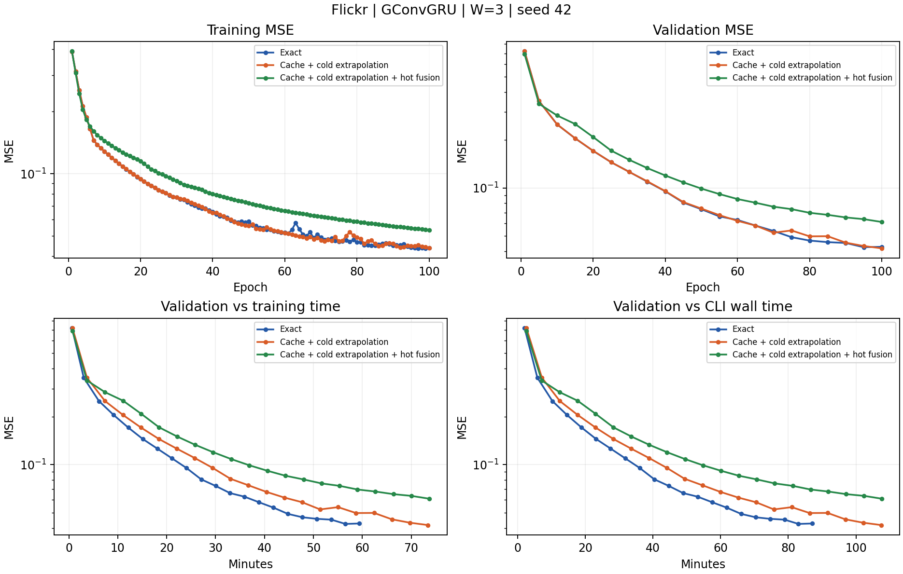

# Flickr W=3 GConvGRU

**状态：三组已完成。**

三组采用相同窗口、节点监督、seed 和优化器。测试列为各组实际返回状态的 MSE。

| 组别 | 轮数 | 最优验证 MSE | 选中轮 | 实际测试 MSE | 训练秒/轮中位数（第2轮起） |
|---|---:|---:|---:|---:|---:|
| Exact | 100 | 0.04239000 | 95 | 0.04670891 | 35.52 |
| Cache + cold extrapolation | 100 | 0.04170501 | 100 | 0.04634321 | 43.98 |
| Cache + cold extrapolation + hot fusion | 100 | 0.06106846 | 100 | 0.06049860 | 44.19 |

时间含读取审计。旧实验独占 GPU 2/3，新实验独占 0/1，但共享 CPU/存储。单 seed 尚不能说明统计显著性。

## 最后训练轮的逐槽位读取

| 组别 | 状态 | 槽位（旧→新） | 平均滞后 | 有非零外推量的行数 |
|---|---|---:|---:|---:|
| cache | cold_history_inputs | 0 | 0.0000 | 0 |
| cache | cold_history_inputs | 1 | 0.0000 | 0 |
| cache | cold_history_inputs | 2 | 0.0000 | 0 |
| cache | hot_shared_predictions | 0 | 0.4994 | 5980188 |
| cache | hot_shared_predictions | 1 | 0.4814 | 5986414 |
| cache | hot_shared_predictions | 2 | 1.4642 | 12435768 |
| smooth | cold_history_inputs | 0 | 0.0000 | 0 |
| smooth | cold_history_inputs | 1 | 0.0000 | 0 |
| smooth | cold_history_inputs | 2 | 0.0000 | 0 |
| smooth | hot_shared_predictions | 0 | 0.4977 | 5959838 |
| smooth | hot_shared_predictions | 1 | 0.4813 | 5985742 |
| smooth | hot_shared_predictions | 2 | 1.4641 | 12435768 |

热点预测目标为当前快照输出；冷节点输入目标为前一快照输出，两者滞后不能混算。

配置、过滤、公式和计时范围见 [protocol.md](protocol.md)。原始指标见 [raw](raw)，达到固定验证阈值的时间见 [time_to_target.csv](time_to_target.csv)（仅按验证观测点统计）。
