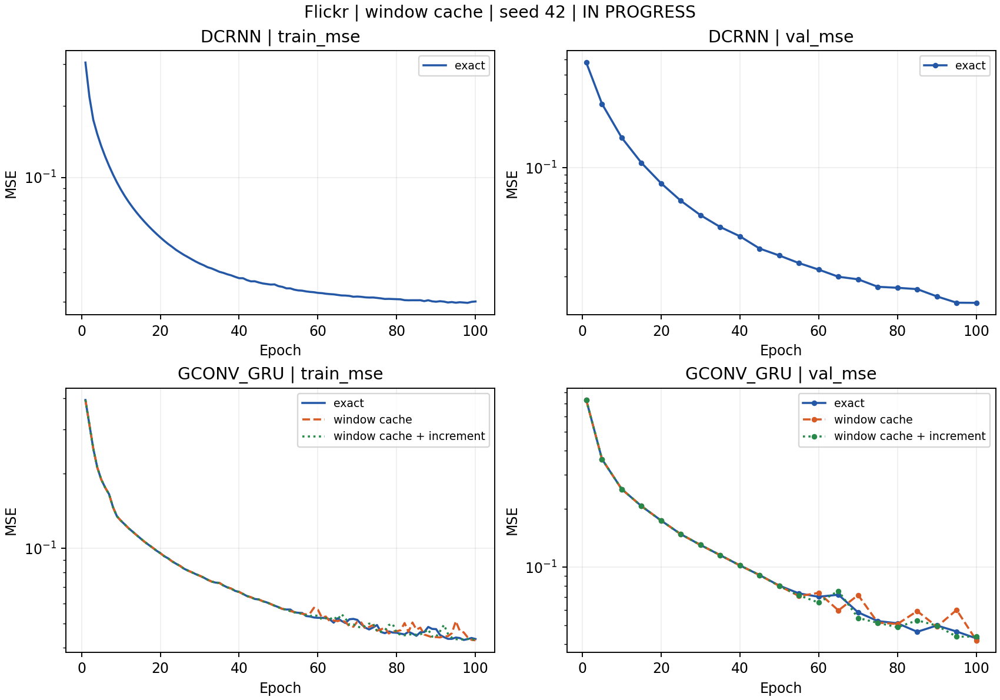
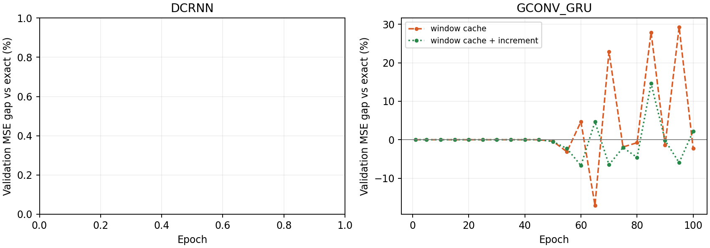
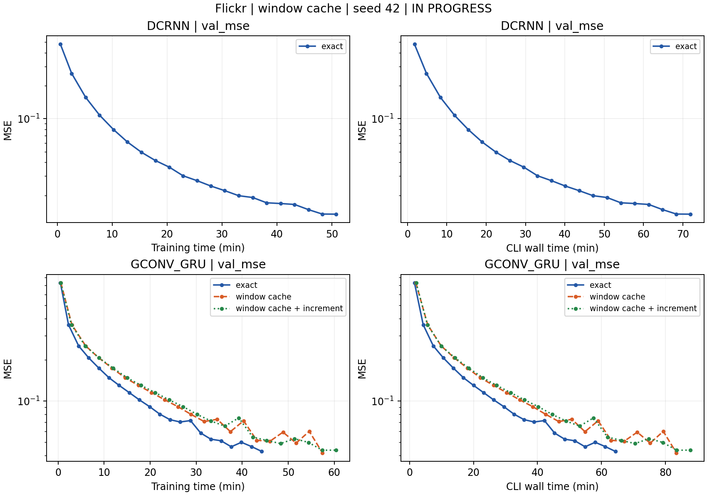

# Flickr 滑动窗口缓存：收敛与耗时

**状态：GConvGRU 三组完成；DCRNN 缓存/补偿暂缓。**

**语义范围：本轮 W=1，comp 组使用 γ 缩放 increment 的原公式。它不验证随后明确的“本地 UPDATE 输出与共享预测状态加权”的多槽位平滑聚合。**

执行顺序已按用户要求改为 GConvGRU 优先。DCRNN exact 已完成；其缓存组在首轮记录前停止，补偿组未启动，两组暂缓。GConvGRU 三组均已完成。

DCRNN / GConvGRU，各做 exact、缓存不补偿、缓存加累计 increment 与可学习 γ。Flickr 节点下一快照 log-in-degree 回归，seed=42、hidden=8、lr=0.001、两卡、10% 热点。沿用每 batch 一个快照，W=1 加前驱槽；checkpoint 按实际策略验证 MSE 选择。

| 模型 | 组别 | 轮数 | 最优验证 MSE | 选中轮 | 实际 test MSE | 同 checkpoint exact test MSE |
|---|---|---:|---:|---:|---:|---:|
| dcrnn | exact | 100 | 0.013479 | 100 | 0.023347 | 0.023347 |
| gconv_gru | exact | 100 | 0.042842 | 100 | 0.045010 | 0.045010 |
| gconv_gru | cache | 100 | 0.041868 | 100 | 0.044934 | 0.044934 |
| gconv_gru | comp | 100 | 0.043705 | 95 | 0.046093 | 0.046093 |

| 模型 | 组别 | 平均训练秒/轮 | 第 2 轮起中位秒/轮 | 训练分钟 | 训练+验证分钟 | 至末轮墙钟分钟 | 峰值 allocated GiB |
|---|---|---:|---:|---:|---:|---:|---:|
| dcrnn | exact | 30.48 | 30.33 | 50.79 | 71.77 | 71.86 | 2.04 |
| gconv_gru | exact | 26.55 | 26.45 | 44.25 | 64.31 | 64.36 | 1.86 |
| gconv_gru | cache | 34.46 | 34.22 | 57.43 | 83.36 | 83.41 | 3.41 |
| gconv_gru | comp | 36.25 | 36.20 | 60.42 | 87.59 | 87.77 | 3.44 |

每个模型固定使用同一对 A40，三组按顺序执行；两个模型不共享 GPU，但共享 CPU 和磁盘。训练计时含读取审计，不含轮前重置和轮末审计汇总；验证含预热重放。墙钟从 CLI 入口计时，含启动加载、状态重置和检查点，末轮墙钟不含最终测试。Prepare 不在上述计时中；首轮可能与 Prepare 收尾重叠，另列第 2 轮起中位数。峰值是整个运行中两 rank 最大的 PyTorch allocated 值，非整卡使用量；缓存组还建立 exact 重放状态管理器。这些是带审计的实测运行时间，未分解通信、计算、热点复制和缓存开销。

| 模型 | 组别 | 验证 MSE 阈值 | 首次观测轮 | 训练分钟 | 训练+验证分钟 |
|---|---|---:|---:|---:|---:|
| dcrnn | exact | 0.05 | 30 | 15.31 | 22.41 |
| dcrnn | exact | 0.02 | 65 | 33.05 | 47.08 |
| gconv_gru | exact | 0.1 | 45 | 19.90 | 29.43 |
| gconv_gru | exact | 0.05 | 85 | 37.63 | 54.82 |
| gconv_gru | cache | 0.1 | 45 | 26.05 | 38.48 |
| gconv_gru | cache | 0.05 | 90 | 51.71 | 75.20 |
| gconv_gru | comp | 0.1 | 45 | 27.17 | 40.06 |
| gconv_gru | comp | 0.05 | 80 | 48.35 | 70.33 |

验证每五轮一次，达到阈值的时间只按观测点判断。

| 模型 / 组别 | 最后训练轮热点历史平均滞后 | 冷邻居平均滞后 | 全程滞后且 increment 非零行数 | 最终 sigmoid(γ) |
|---|---:|---:|---:|---:|
| dcrnn / exact | 0.0000 | 0.0000 | 0 | 待完成 |
| gconv_gru / exact | 0.0000 | 0.0000 | 0 | 待完成 |
| gconv_gru / cache | 0.0000 | 0.0000 | 0 | 待完成 |
| gconv_gru / comp | 0.0000 | 0.0000 | 0 | 0.6225 |

滞后审计读取模型补偿前的实际缓存；increment 非零且滞后才可能产生非零补偿。γ 列为生效系数 sigmoid(γ)，原始参数也保留在 JSONL。新路径的 shared mask 包括所有非 owner 历史行（热点副本与冷邻居），不能直接与上次 hot-only shared 比例比较。

这是单 seed、固定 100 轮预算实验；是否达到收敛平台需检查末段趋势。Flickr persistence 基线：验证 MSE=0.00562756，测试 MSE=0.01507541（同一数据与划分）。DCRNN 仍有逐快照 reset-gate 交换；max_staleness 控制发布跳过次数，不是实际快照年龄上界。

配置和限制见 [protocol.md](protocol.md)，原始指标见 [raw](raw)，汇总见 [summary.json](summary.json)，时间明细见 [timing.csv](timing.csv) 与 [time_to_target.csv](time_to_target.csv)。运行 `python analyze.py` 可重新生成图表。
